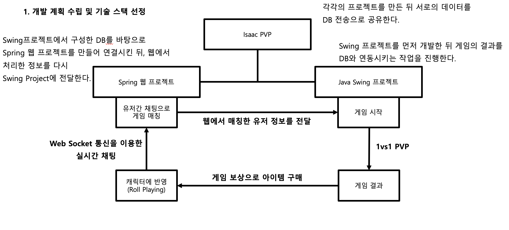
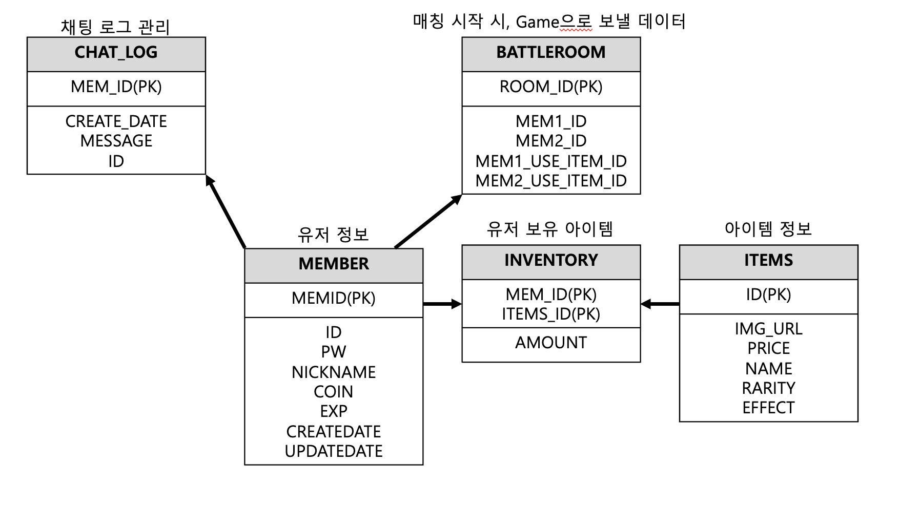

# Isaac RPG
>> URL : http://ourisaacweb.com/home
## 시연영상

<h2> KoreaIT Academy</h2>
<h3> 과정평가형 정보처리산업기사 과정</h3>

### SSD 팀 
    - (팀장) 조성연
    - 임강욱
    - 최낙연

### 개요
    - 프로젝트 지속 기간 : 2023.10 - 2023.12 (2개월)
    - 개발 언어: Java
    - 개발 환경 : IntelliJ
    
### 담당 역할
| 조성연                                                                                                                                                                                                                                           | 임강욱                                                                                                                                                                                    | 최낙연                                                                                                                                                                             |
|-----------------------------------------------------------------------------------------------------------------------------------------------------------------------------------------------------------------------------------------------|----------------------------------------------------------------------------------------------------------------------------------------------------------------------------------------|---------------------------------------------------------------------------------------------------------------------------------------------------------------------------------|
| - Swing Project 총관 담당 - Socket Server 통신 - Thread 설계 및 구성 - 채팅 기능 설계 - Repository 기능 연결 - Component 설계 - 서버(AWS) 연결 및 배포 - 플레이어, 데이터 클래스 구성 - 매칭 룸 기능 설계 - Swing 과 Spring 프로젝트 연결 - 게임 내 소켓 양방향 통신 구현 | - Swing Project 총관 담당 - Github 관리 - DB 구성 및 구조 제작 - Web Frontend 설계  - Thymeleaf layout 구성요소 제작  - 인벤토리 페이지 설계 - 로그인 기능 구현 - 회원가입 기능 구현 - XML Query 설계 | - 아이템 및 리소스 제작 - 몬스터 및 캐릭터 공격 모션 - Router - 홈화면 설계 - 스프라이트 이미지 애니메이션 제작 - Swing Project 솔로 플레이 담당 - 아이템 기능 및 모션 설계 - 스토리 보드 작성 - 실제 구현 영상 편집 작업 |

### 사용 기술 스택

|  Spring 웹 프로젝트                                                                                                                                                                                          | Java Swing 프로젝트              | 공용 사용 툴                                                                                    |
|---------------------------------------------------------------------------------------------------------------------------------------------------------------------------------------------------------|------------------------------|--------------------------------------------------------------------------------------------|
| - Spring Boot - Spring Security - AWS - JDBC Template - XML Mapper - Oracle - H2 - JPA - Gradle - Kotlin - JS - AJAX - Thymeleaf - Custom Exception | - Java Swing - Component | - Java - Socket - Java Web Socket - Github - Thread - In-Output Stream |

### 프로젝트 개발 계획

### DB 스키마

### 개발 과정 

- Spring Boot 사용 MVC패턴 Contorller, Vo(Value Object), Service, Mapper(XML), Repo(Repository)사용
- 클래스의 데이터 관리(Getter, Setter, Constructor)는 Lombok을 활용 
- Controller에서 mapping(Get, Post, Request) 어노테이션을 사용하여 URL 세팅 View정보는 ModelAndView를 통해 주입 View에서 Thymeleaf(th:)를 통해 html 파일 세팅 추가 적인 부분은 (Jquery, BootStrap, Modal)을 활용 
- Sql 데이터 CRUD(Create, Read, Update, Delete)는 Mapper와 JDBCTemplate를 사용한 Class Repo, JPA를 사용한 interface Repo를 사용 쿼리문 세팅이 복잡한 경우 Mapper와 JDBCTemplate을 사용하였고 테이블이 큰 경우는 DB프로그램에서 직접 테이블 생성 
- 쿼리문이 간단하거나 테이블이 작은 경우 JPA를 사용 함 
- 채팅이나 게임 연결 등 실시간 갱신이 필요한 데이터는 Js와 WebSocket, Socket, LongPolling을 활용함 
- 로그인시 유저 정보 저장은 HttpSession을 사용 하여 저장 유지시간 설정 및 로그아웃이 비워지는 데이터는 Config를 사용 
- 중복 로그인 발생은 각 Session을 List에 저장하여 로그인 될 때 검사 
- DB에 저장되는 비밀번호는 Spring Security를 사용하여 암호화 
- 사용자 정보가 필요한 페이지나 오류가 있으나 Exception이 필요한 부분은 직접 세팅하거나 오류 페이지 매핑을 만들어 throw되게 설정(오류 페이지 매핑은 ControllerAdvice를 이용해 전역으로 뿌림) 
- 페이지에서 서버로 데이터를 보내는 경우는 Ajax와 js Fetch를 사용

### 느낀점 및 성장한 점
#### 조성연
>
#### 임강욱
>그동안 JAVA를 이용하여 웹프로젝트를 했던 저에게 JAVA의 확장성을 느끼게 해준 프로젝트였습니다. Swing 프로젝트와 Spring Boot 프로젝트를 연결하면서 데이터를 서로 주고받고 그것을 실시간 갱신하는 기능을 구현하는 과정에서 많은 시행착오를 겪었고 JAVA의 기초지식이 부족함을 느끼게 해준 프로젝트 였습니다. JAVA로 웹 페이지밖에 만들지 않았던 저에게 팀원들이 Swing과 소켓통신을 알려주어 실력을 늘릴 수 있었으며, 팀원들에게 Spring Boot와 DBMS 구성을 알려주며 자신의 지식을 확인할 수 있는 기회도 되었습니다.. 지금까지 사이즈가 작은 프로젝트만 진행 했었지만 이번 기회를 통해 더 크고 복합적인 프로젝트를 관리하고 제작하면서 팀워크의 중요성을 알고 식견을 넓힐 수 있었습니다
#### 최낙연
>
